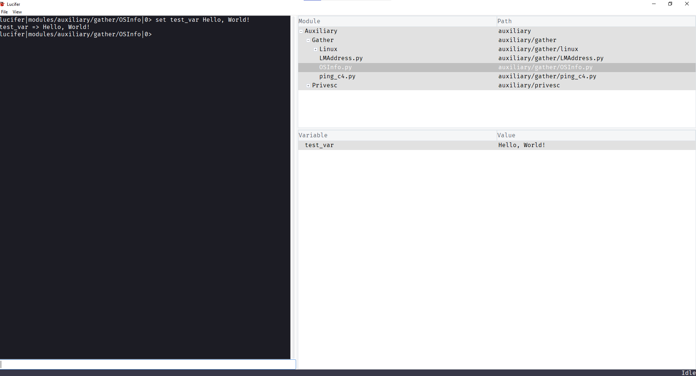
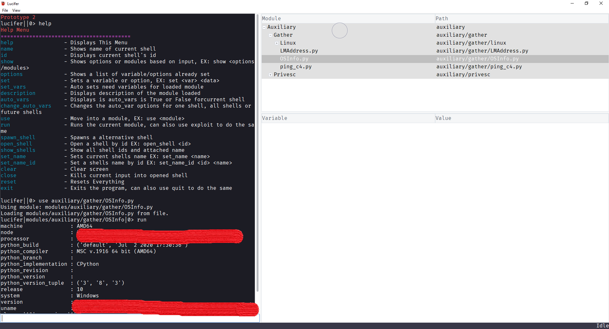
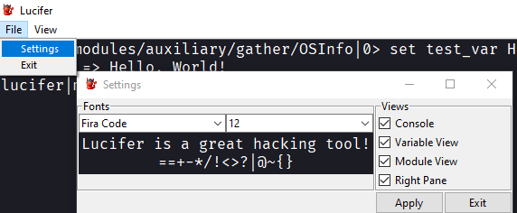

# Lucifer

[](https://www.python.org/)
[](https://GitHub.com/Skiller9090/)
[]()

[](https://app.codacy.com/manual/alexspam9090/Lucifer?utm_source=github.com&utm_medium=referral&utm_content=Skiller9090/Lucifer&utm_campaign=Badge_Grade_Dashboard)
[](https://codeclimate.com/github/Skiller9090/Lucifer/maintainability)
[](https://www.codefactor.io/repository/github/skiller9090/lucifer)
[](https://GitHub.com/Skiller9090/Lucifer/releases/)
[](https://GitHub.com/Skiller9090/Lucifer/commit/)
[](https://GitHub.com/Skiller9090/Lucifer/graphs/contributors/)
[](https://GitHub.com/Skiller9090/Lucifer/issues/)
[](https://github.com/Skiller9090/badges/)

[](https://codescene.io/projects/9260)
[](https://codescene.io/projects/9260)

`Initial Release`: 09/09/2020

## Setup
```shell
git clone https://github.com/Skiller9090/Lucifer.git
cd Lucifer
pip install -r requirements.txt
python main.py --help
```
If you want the cutting edge changes add `-b dev` to the end of `git clone https://github.com/Skiller9090/Lucifer.git`

## Commands
| Command            | Description                                                             |
| ------------------ | ----------------------------------------------------------------------- |
|help                | Displays This Menu                                                      |
|name                | Shows name of current shell                                             |
|id                  | Displays current shell's id                                             |
|show                | Shows options or modules based on input, EX: show <options/modules>     | 
|options             | Shows a list of variable/options already set                            |
|set                 | Sets a variable or option, EX: set <var> <data>                         |
|set_vars            | Auto sets need variables for loaded module                              |
|description         | Displays description of the module loaded                               |
|auto_vars           | Displays is auto_vars is True or False for current shell                |  
|change_auto_vars    | Changes the auto_var options for one shell, all shells or future shells | 
|use                 | Move into a module, EX: use <module>                                    |
|run                 | Runs the current module, can also use exploit to do the same            | 
|spawn_shell         | Spawns a alternative shell                                              |
|open_shell          | Open a shell by id EX: open_shell <id>                                  |
|show_shells         | Show all shell ids and attached name                                    |
|set_name            | Sets current shells name EX: set_name <name>                            |
|set_name_id         | Set a shells name by id EX: set_name_id <id> <name>                     | 
|clear               | Clear screen                                                            |
|close               | Kills current input into opened shell                                   |
|reset               | Resets Everything                                                       |
|exit                | Exits the program, can also use quit to do the same                     |  

### Command Use
- #### No-Arg Commands  
  - `help` - to display help menu

  - `name` - shows name of current shell
  
  - `id` - shows current shell id
  
  - `options` - shows a table of set options/vars
  
  - `set_vars` - automatically sets vars needed for the loaded module (default defined in a module)
  
  - `description` - show description of current loaded module
  
  - `auto_vars` - displays current setting of auto_vars (auto_vars if true will automatically run set_vars on module load)  
  
  - `run` - runs the module with the current options, `exploit` works the same  
  
  - `spawn_shell` - spawns a new Shell instance  
  
  - `show_shells` - shows all open shells ids and names  
  
  - `clear` - clears the terminal/console screen  
  
  - `close` - kills the input to current shell  
  
  - `reset` - resets everything (not implemented)  
  
  - `exit` - quits the program  


- #### Arg Commands
  - `show <options/modules>` - displays a list of set options or modules depending on argument.  
  
  - `set <var_name> <value>` - sets a variable/option  
  
  - `change_auto_vars <to_set> <args>`:  
    - `<to_set>` - can be true or false (t or f) (-t or -f)  
    
    - `<args>`:  
      - `-g` = global    - sets for all shells spawned  
      
      - `-n` = new       - sets this option for future shell spawns   
       
      - `-i` = inclusive - no matter what, set current shell to <to_set>  

  - `use <module> <args>`:
    - `<module>` - path to module
    
    - `<args>`:
      - `-R` - Override cache (reload dynamically)
      
  - `open_shell <id>` - opens a shell by its id
  
  - `set_name <name>` - set the name of the current shell
  
  - `set_name_id <id> <name>` - set the name of the shell specified by <id>

## Examples

### Settings Variables


### Running Module


### Settings
  
